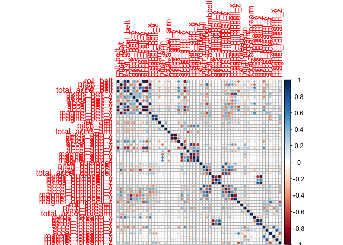

# Human Activity Recognition - Weight Lifting Exercise Dataset

* Author: Ian Grundy
* Date: 22 November 2015

## Synopsis

Wearable devices such as Jawbone Up, Nike FuelBand, and Fitbit make collecting large amounts of data about human activity very easy. Such human activity recognition (HAR) data has traditionally been used to predict, from a number of possibilities, which activity was performed at a specific point in time.  

The focus of the Weight Lifting Dataset, analysed here, is slightly different. This data was collected to investigate *how well* one particular activity was performed by the wearer. Six participants were each asked to perform one set of 10 repetitions a single activity, the Unilateral Dumbbell Biceps Curl, in five different fashions: exactly according to the specification (Class A), throwing the elbows to the front (Class B), lifting the dumbbell only halfway (Class C), lowering the dumbbell only halfway (Class D) and throwing the hips to the front (Class E). The supplied data was partitioned into training and test sets for prediction (and assessment) purposes.

Here, we build a model for classifying the way each activity was performed (either A, B, C, D or E) based on the wearable device physical measurements, using the Random Forests method. The method is shown to be very accurate on this data, with a better than 99% out-of-sample accuracy. When supplied with the (unseen) test set of 20 cases, the method performed extremely well, getting all 20 cases correct.

## Data 

* Dataset: Weight lifting data, consisting of 
* Training Set: 19622 observations of 160 variables
* Test Set: 20 observations of 160 variables

Read more: [http://groupware.les.inf.puc-rio.br/har#ixzz3sFLppXgK](http://groupware.les.inf.puc-rio.br/har#ixzz3sFLppXgK)

## Pre-Processing the Data

We begin by loading the packages we will need:


```r
library(ggplot2)
library(lattice)
library(caret)
library(randomForest)
```


We download the training data from

[https://d396qusza40orc.cloudfront.net/predmachlearn/pml-training.csv](https://d396qusza40orc.cloudfront.net/predmachlearn/pml-training.csv)

and the test data from

[https://d396qusza40orc.cloudfront.net/predmachlearn/pml-testing.csv](https://d396qusza40orc.cloudfront.net/predmachlearn/pml-testing.csv)

There are many missing values in the data, denoted "blank" or "NA". The blanks are converted to "NA" at read time.

There are 406 rows in the dataset, corresponding to ```new_window = "yes"``` which have values for all 160 variables.
The bulk of the data, i.e. the other 19216 rows, has missing values in 100 columns. These columns clearly have no prediction value. Any column with more than 50% missing values is removed from the training and testing data sets. 

This leaves 60 columns, of which the first seven are identification variables (```X```, ```user_name```, ``` raw_timestamp_part_1```, ```raw_timestamp_part_2```, ```cvtd_timestamp```, ```new_window```, ```num_window```) which are not needed in the prediction process, and the last is the target variable for the classification task ```classe``` which takes values in the set {A, B, C, D, E}.

We discard the first seven columns, retaining 52 predictors, plus the label/target variable ```classe```.

The variables retained are 


```
##  [1] "roll_belt"            "pitch_belt"           "yaw_belt"            
##  [4] "total_accel_belt"     "gyros_belt_x"         "gyros_belt_y"        
##  [7] "gyros_belt_z"         "accel_belt_x"         "accel_belt_y"        
## [10] "accel_belt_z"         "magnet_belt_x"        "magnet_belt_y"       
## [13] "magnet_belt_z"        "roll_arm"             "pitch_arm"           
## [16] "yaw_arm"              "total_accel_arm"      "gyros_arm_x"         
## [19] "gyros_arm_y"          "gyros_arm_z"          "accel_arm_x"         
## [22] "accel_arm_y"          "accel_arm_z"          "magnet_arm_x"        
## [25] "magnet_arm_y"         "magnet_arm_z"         "roll_dumbbell"       
## [28] "pitch_dumbbell"       "yaw_dumbbell"         "total_accel_dumbbell"
## [31] "gyros_dumbbell_x"     "gyros_dumbbell_y"     "gyros_dumbbell_z"    
## [34] "accel_dumbbell_x"     "accel_dumbbell_y"     "accel_dumbbell_z"    
## [37] "magnet_dumbbell_x"    "magnet_dumbbell_y"    "magnet_dumbbell_z"   
## [40] "roll_forearm"         "pitch_forearm"        "yaw_forearm"         
## [43] "total_accel_forearm"  "gyros_forearm_x"      "gyros_forearm_y"     
## [46] "gyros_forearm_z"      "accel_forearm_x"      "accel_forearm_y"     
## [49] "accel_forearm_z"      "magnet_forearm_x"     "magnet_forearm_y"    
## [52] "magnet_forearm_z"     "classe"
```

## Data Exploration and Dimension Reduction

We explore the data to investigate whether the total of 52 predictor variables can or should be reduced.

Firstly, we examine the variance of each of the predictors:


```
##                      freqRatio percentUnique zeroVar   nzv
## roll_belt             1.101904     6.7781062   FALSE FALSE
## pitch_belt            1.036082     9.3772296   FALSE FALSE
## yaw_belt              1.058480     9.9734991   FALSE FALSE
## total_accel_belt      1.063160     0.1477933   FALSE FALSE
## gyros_belt_x          1.058651     0.7134849   FALSE FALSE
## gyros_belt_y          1.144000     0.3516461   FALSE FALSE
## gyros_belt_z          1.066214     0.8612782   FALSE FALSE
## accel_belt_x          1.055412     0.8357966   FALSE FALSE
## accel_belt_y          1.113725     0.7287738   FALSE FALSE
## accel_belt_z          1.078767     1.5237998   FALSE FALSE
## magnet_belt_x         1.090141     1.6664968   FALSE FALSE
## magnet_belt_y         1.099688     1.5187035   FALSE FALSE
## magnet_belt_z         1.006369     2.3290184   FALSE FALSE
## roll_arm             52.338462    13.5256345   FALSE FALSE
## pitch_arm            87.256410    15.7323412   FALSE FALSE
## yaw_arm              33.029126    14.6570176   FALSE FALSE
## total_accel_arm       1.024526     0.3363572   FALSE FALSE
## gyros_arm_x           1.015504     3.2769341   FALSE FALSE
## gyros_arm_y           1.454369     1.9162165   FALSE FALSE
## gyros_arm_z           1.110687     1.2638875   FALSE FALSE
## accel_arm_x           1.017341     3.9598410   FALSE FALSE
## accel_arm_y           1.140187     2.7367241   FALSE FALSE
## accel_arm_z           1.128000     4.0362858   FALSE FALSE
## magnet_arm_x          1.000000     6.8239731   FALSE FALSE
## magnet_arm_y          1.056818     4.4439914   FALSE FALSE
## magnet_arm_z          1.036364     6.4468454   FALSE FALSE
## roll_dumbbell         1.022388    84.2065029   FALSE FALSE
## pitch_dumbbell        2.277372    81.7449801   FALSE FALSE
## yaw_dumbbell          1.132231    83.4828254   FALSE FALSE
## total_accel_dumbbell  1.072634     0.2191418   FALSE FALSE
## gyros_dumbbell_x      1.003268     1.2282132   FALSE FALSE
## gyros_dumbbell_y      1.264957     1.4167771   FALSE FALSE
## gyros_dumbbell_z      1.060100     1.0498420   FALSE FALSE
## accel_dumbbell_x      1.018018     2.1659362   FALSE FALSE
## accel_dumbbell_y      1.053061     2.3748853   FALSE FALSE
## accel_dumbbell_z      1.133333     2.0894914   FALSE FALSE
## magnet_dumbbell_x     1.098266     5.7486495   FALSE FALSE
## magnet_dumbbell_y     1.197740     4.3012945   FALSE FALSE
## magnet_dumbbell_z     1.020833     3.4451126   FALSE FALSE
## roll_forearm         11.589286    11.0895933   FALSE FALSE
## pitch_forearm        65.983051    14.8557741   FALSE FALSE
## yaw_forearm          15.322835    10.1467740   FALSE FALSE
## total_accel_forearm   1.128928     0.3567424   FALSE FALSE
## gyros_forearm_x       1.059273     1.5187035   FALSE FALSE
## gyros_forearm_y       1.036554     3.7763735   FALSE FALSE
## gyros_forearm_z       1.122917     1.5645704   FALSE FALSE
## accel_forearm_x       1.126437     4.0464784   FALSE FALSE
## accel_forearm_y       1.059406     5.1116094   FALSE FALSE
## accel_forearm_z       1.006250     2.9558659   FALSE FALSE
## magnet_forearm_x      1.012346     7.7667924   FALSE FALSE
## magnet_forearm_y      1.246914     9.5403119   FALSE FALSE
## magnet_forearm_z      1.000000     8.5771073   FALSE FALSE
```

We cannot reduce the number of predictors on the basis of variance, as none of them can be classified as having zero or near-zero variance.

Next, we turn to correlation. The correlation plot shown below shows the strength of the correlations between all 52 predictors:

 

On the whole, with a only few exceptions, most of the variables are weakly correlated at best. This suggests that dimension reduction using, for example, principal components will not bring a significant benefit to the model.

Consequently, the prediction model (see below) will use the raw values of all 52 predictors.

## Partitioning the Data


In order to facilitate estimation of the out-of-sample classification error, we further partition the *training data* using ```createDataPartition()``` with ```p = 0.75``` to form a training set ```myTrain``` with 
14718 rows, and a testing set ```myTest``` with 
4904 rows. 

## Building the Model

We choose here to build our prediction model using Random Forests, which is well known as a very accurate prediction method that runs efficiently on big data and can thousands of input variables. For our purposes, it is also very useful that Random Forests generate an internal unbiased estimate of the out-of-sample error as part of the forest building process.

Random Forests work by taking ```N``` samples (with replacement) of the training data. A decision tree is built for each of the ```N``` samples. At each split in each tree, only a random subset of size ```m``` of the ```M``` predictor variables is used. Predicted values are obtained by averaging the predictions of the ```N``` decision trees. 

We have chosen here to use Random Forests with the options ```method = "cv"``` and  ```number = 10```. This means that the Random Forests algorithm will use cross validation with 10 folds to tune the ```m``` parameter. The tuning process makes use of the ```OOB``` or "out-of-bag" error to choose the best model, and this ```OOB``` error serves as a good estimate of the out-of-sample error. 


Note - our model is trained using the ```myTrain``` data only. 

The final model and properties of the fit are shown below:


```
## Random Forest 
## 
## 14718 samples
##    52 predictor
##     5 classes: 'A', 'B', 'C', 'D', 'E' 
## 
## No pre-processing
## Resampling: Cross-Validated (10 fold) 
## Summary of sample sizes: 13247, 13247, 13246, 13246, 13246, 13245, ... 
## Resampling results across tuning parameters:
## 
##   mtry  Accuracy   Kappa      Accuracy SD  Kappa SD   
##    2    0.9924584  0.9904596  0.002158556  0.002731164
##   27    0.9930698  0.9912325  0.002557819  0.003236120
##   52    0.9890610  0.9861603  0.003955027  0.005004026
## 
## Accuracy was used to select the optimal model using  the largest value.
## The final value used for the model was mtry = 27.
```

```
## 
## Call:
##  randomForest(x = x, y = y, mtry = param$mtry) 
##                Type of random forest: classification
##                      Number of trees: 500
## No. of variables tried at each split: 27
## 
##         OOB estimate of  error rate: 0.66%
## Confusion matrix:
##      A    B    C    D    E  class.error
## A 4181    2    1    0    1 0.0009557945
## B   26 2812   10    0    0 0.0126404494
## C    0   13 2550    4    0 0.0066225166
## D    0    1   24 2385    2 0.0111940299
## E    0    1    4    8 2693 0.0048041390
```

As we can see above, ```mtry``` parameter (which represents ```m``` above) has an optimal value of 27.  The ```OOB``` error rate is estimated to be 0.66%. 

## Out-of-Sample Error

We now estimate the out-of-sample error *directly* using the testing set ```myTest```:


```
## Confusion Matrix and Statistics
## 
##           Reference
## Prediction    A    B    C    D    E
##          A 1394    4    0    0    0
##          B    0  943    5    0    1
##          C    1    2  846   13    2
##          D    0    0    4  790    5
##          E    0    0    0    1  893
## 
## Overall Statistics
##                                           
##                Accuracy : 0.9923          
##                  95% CI : (0.9894, 0.9945)
##     No Information Rate : 0.2845          
##     P-Value [Acc > NIR] : < 2.2e-16       
##                                           
##                   Kappa : 0.9902          
##  Mcnemar's Test P-Value : NA              
## 
## Statistics by Class:
## 
##                      Class: A Class: B Class: C Class: D Class: E
## Sensitivity            0.9993   0.9937   0.9895   0.9826   0.9911
## Specificity            0.9989   0.9985   0.9956   0.9978   0.9998
## Pos Pred Value         0.9971   0.9937   0.9792   0.9887   0.9989
## Neg Pred Value         0.9997   0.9985   0.9978   0.9966   0.9980
## Prevalence             0.2845   0.1935   0.1743   0.1639   0.1837
## Detection Rate         0.2843   0.1923   0.1725   0.1611   0.1821
## Detection Prevalence   0.2851   0.1935   0.1762   0.1629   0.1823
## Balanced Accuracy      0.9991   0.9961   0.9925   0.9902   0.9954
```

On the held-out ```myTest``` data, the prediction accuracy is 99.23%, or in other words, the expected out-of-sample error rate is 0.77%. This agrees closely with the out-of-sample error estimate generated by Random Forests. 

Based on ```myTest``` , we expect a greater than 99% accuracy for this classifier.

## Performance on the Test Data

It remains to determine how the classifier actually performs on the unlabelled test set. For the 20 cases given, the classifier predicts all 20 correctly.


